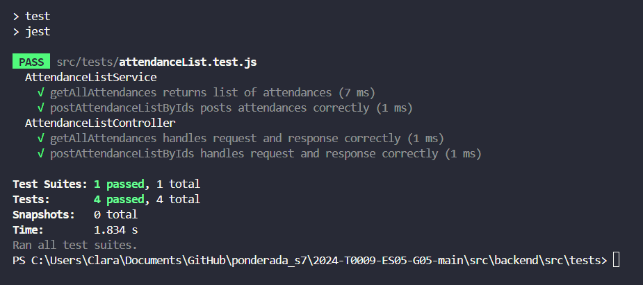

# ponderada_s7

Ponderada referente à semana 7 - testes automatizados

# Documentação de Testes Automatizados

## Introdução

Esta seção da documentação foca na descrição detalhada dos testes automatizados desenvolvidos para as funcionalidades AttendanceListService e AttendanceListController. Estes testes têm como finalidade assegurar a correta funcionalidade e a integridade das operações relacionadas ao registro e à consulta de listas de presença na API.

## Testes Implementados

### Service Tests

#### Teste 1: getAllAttendances retorna lista de presenças

- **Objetivo:** Verificar se a lista completa de presenças é retornada.
- **Pré-condição:** Banco de dados contém registros de presenças.
- **Procedimento de Teste:** Invocar o método getAllAttendances.
- **Resultado Esperado:** Uma lista contendo todos os registros de presenças é retornada.
- **Resultado Obtido:** Lista de presenças retornada com sucesso.
- **Pós-condição:** Nenhuma alteração no estado do banco de dados.

#### Teste 2: postAttendanceListByIds registra presenças corretamente

- **Objetivo:** Assegurar que a presença dos alunos seja registrada corretamente.
- **Pré-condição:** IDs de alunos e ID de aula válidos são fornecidos.
- **Procedimento de Teste:** Executar o método postAttendanceListByIds com um array de IDs de alunos e um ID de aula.
- **Resultado Esperado:** Os registros de presença são criados no banco de dados, e os IDs das inserções são retornados.
- **Resultado Obtido:** Presenças registradas corretamente, e IDs das inserções retornados.
- **Pós-condição:** Novos registros de presença são adicionados ao banco de dados.

### Controller Tests

#### Teste 3: getAllAttendances manipula requisição e resposta corretamente

- **Objetivo:** Confirmar que a rota de obtenção de todas as presenças funciona conforme esperado.
- **Pré-condição:** Rota / é acessada.
- **Procedimento de Teste:** Enviar uma requisição GET para a rota /.
- **Resultado Esperado:** O controlador responde com a lista completa de registros de presença.
- **Resultado Obtido:** Lista completa de presenças retornada com sucesso.
- **Pós-condição:** Estado do banco de dados inalterado.

#### Teste 4: postAttendanceListByIds processa requisição e resposta corretamente

- **Objetivo:** Verificar se a rota de registro de presenças processa corretamente os dados enviados.
- **Pré-condição:** Rota /attendanceListIds/:ids é acessada com um corpo de requisição contendo studentIds e lessonId.
- **Procedimento de Teste:** Enviar uma requisição POST para a rota /attendanceListIds/:ids com studentIds e lessonId.
- **Resultado Esperado:** Controlador processa a requisição e retorna os IDs dos registros de presença criados.
- **Resultado Obtido:** IDs dos novos registros de presença retornados com sucesso.
- **Pós-condição:** Novos registros de presença são adicionados ao banco de dados.ctativa:* O controlador deve processar a requisição e retornar os IDs das novas inserções de presença no banco de dados.

## Executando os Testes

Para executar os testes, utilize o comando abaixo no terminal:

```
npm test
```

## Resultados obtidos

A execução dos testes resultou em um sucesso total, validando as funcionalidades de registro e consulta de listas de presença implementadas. Todos os cenários testados foram abordados e passaram sem erros, assegurando que tanto o AttendanceListService quanto o AttendanceListController funcionam conforme o esperado. Os detalhes da execução são apresentados abaixo:

<h6 align="center"> Figura 1: Resultado teste de AttendenceList </h6>



<h6 align="center"> Fonte: Elaborado por Clara Coelho Mohammad </h6>